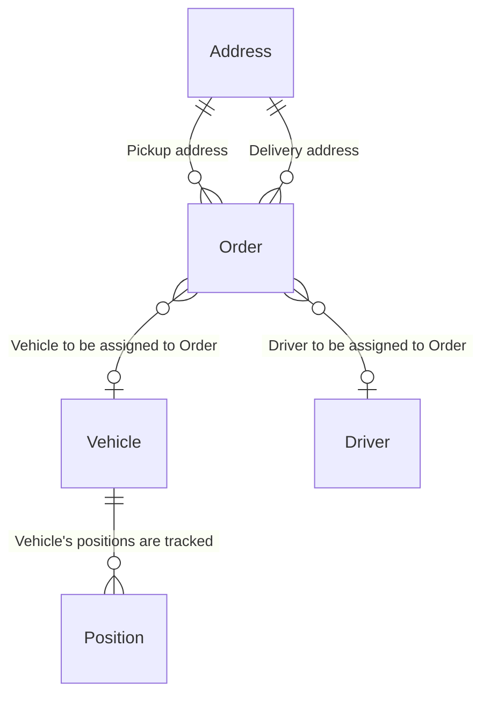

# Transportation Management API

## requirements
make sure you have `Python 3.13` and `uv` installed

## getting started
1. download the repo:
```
git clone https://github.com/TomasKol/swida.git
```
2. sut up the project:

```
cd swida
uv sync
```
3. spin up local SQLite DB:
```
uv run manage.py migrate
uv run manage.py loaddata initial_db_data.json
```
4. spin up local server:
```
uv run manage.py runserver
```

## about the app 
The main feature of this app is to find the optimal vehicle to pick up and deliver a selected order. The selection takes into consideration availability of vehicles and drivers and distance of vehicles to the pickup address.

Swagger docs available at `/api/schema/swagger-ui/`

### The data model:
